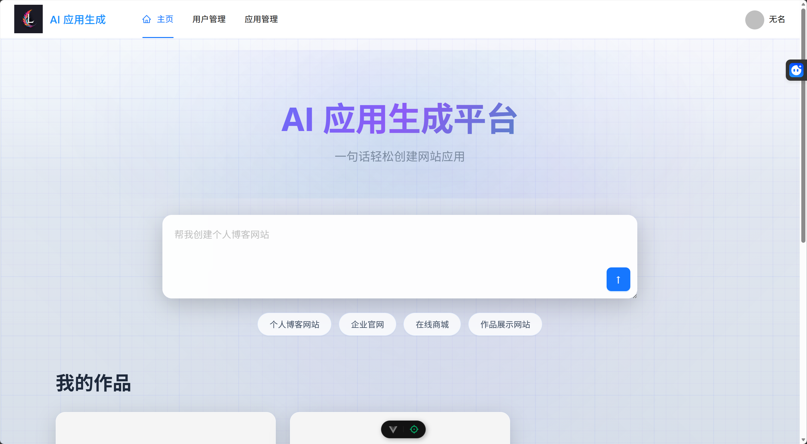
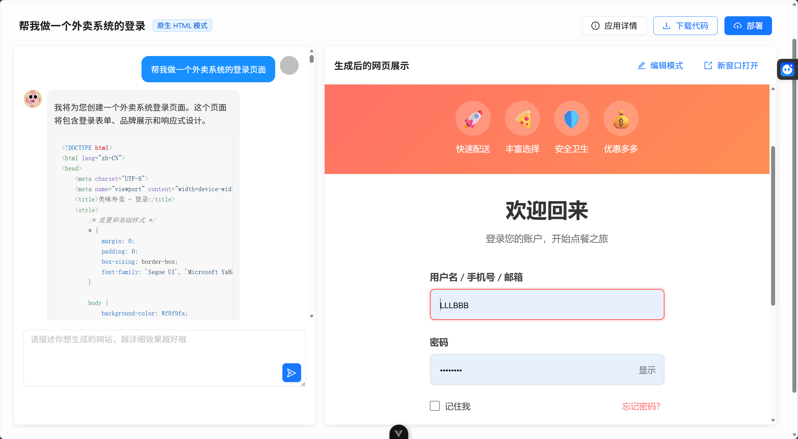

# AI 零代码应用生成平台
## 一、项目介绍
这是一个基于 Spring Boot 3 + LangChain4j + Vue 3 开发的 **企业级 AI 代码生成平台**。
### 4 大核心能力

1）智能代码生成：用户输入需求描述，AI 自动分析并选择合适的生成策略，通过工具调用生成代码文件，采用流式输出让用户实时看到 AI 的执行过程。

2）可视化编辑：生成的应用将实时展示，可以进入编辑模式，自由选择网页元素并且和 AI 对话来快速修改页面，直到满意为止。

3）一键部署分享：可以将生成的应用一键部署到云端并自动截取封面图，获得可访问的地址进行分享，同时支持完整项目源码下载。

查看精选案例：

4）企业级管理：提供用户管理、应用管理、系统监控、业务指标监控等后台功能，管理员可以设置精选应用、监控 AI 调用情况和系统性能。

## 二、更多介绍

功能模块：

.png)

核心业务流程：

架构设计：

